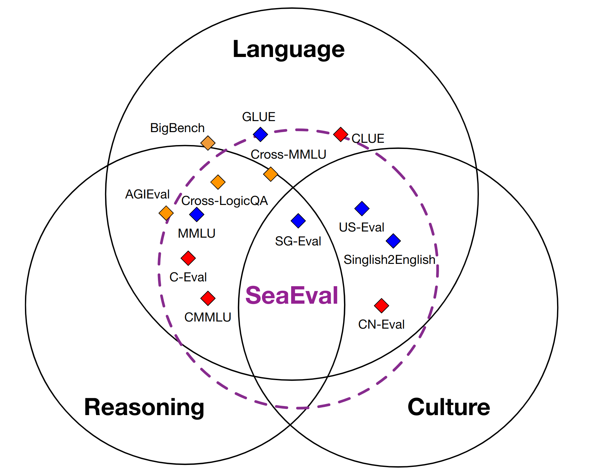

## SeaEval Benchmark: Multilingual Evaluation of LLMs 

[](#python)
[](https://arxiv.org/abs/2309.04766)


SeaEval is a toolkit for evaluating the capability of multilingual large language models (LLMs). Details are presented in paper [SeaEval for Multilingual Foundation Models: From Cross-Lingual Alignment to Cultural Reasoning
](https://arxiv.org/abs/2309.04766).

We assess their generalization ability by evaluating their performance on a wide range of tasks in a zero-shot and five-shot setting. The tasks are available in 7 languages over 28 datasets.


Special focus on: **Cross-Lingual Consistency** and **Cultural Reasoning** 

**Cross-Lingual Consistency**: 2 new datasets with parallel questions in 7 different languages.

**Cross-Lingual Consistency**: 4 new datasets focusing on regions 
including Singaproe, US, China, and the Philipines.

<p align="center">
  
</p>


## Supported Languages: 

**English** & **中文** & **Bahasa Indonesia** & **Español** & **Tiếng Việt** & **Bahasa Melayu** & **Wikang Filipino** & **Singlish**.

## Resources
[\[**Website**\]](https://seaeval.github.io/),
[\[**Datasets**\]](https://huggingface.co/datasets/SeaEval/SeaEval_datasets),
[\[**Paper**\]](https://arxiv.org/abs/2309.04766)


## Exemplary Evaluation Results
We employ the median value derived from **5 distinct prompts** shown on the above leaderboard to mitigate the influence of random variations induced by prompts.


| Index | Datasets | LLaMa-2-7B-Chat | xxx |
| :-------------   |:-------------   |:-------------:| :-----:|
| 1 | **Cross-MMLU**   | 0.00 | 0.00 |
| 2 | **Cross-LogiQA** | 0.00 | 0.00 |
| 3 | **SG_Eval**      | 0.00 | 0.00 |
| 4 | **CN_Eval**      | 0.00 | 0.00 |
| 5 | **US_Eval**      | 0.00 | 0.00 |
| 6 | **PH_Eval**      | 0.00 | 0.00 |
| 7 | **FLoRes_ind2eng**      | 0.00 | 0.00 |
| 8 | **FLoRes_vie2eng**      | 0.00 | 0.00 |
| 9 | **FLoRes_zho2eng**      | 0.00 | 0.00 |
| 10 | **FLoRes_zsm2eng**      | 0.00 | 0.00 |
| 11 | **MMLU**      | 0.00 | 0.00 |
| 12 | **MMLU_Full**      | 0.00 | 0.00 |
| 13 | **C_Eval**      | 0.00 | 0.00 |
| 14 | **C_Eval_Full**      | 0.00 | 0.00 |
| 15 | **CMMLU**      | 0.00 | 0.00 |
| 16 | **CMMLU_Full**      | 0.00 | 0.00 |
| 17 | **Zbench**      | 0.00 | 0.00 |
| 18 | **Ind_Emotion**      | 0.00 | 0.00 |
| 19 | **OCNLI**      | 0.00 | 0.00 |
| 20 | **C3**      | 0.00 | 0.00 |
| 21 | **DREAM**      | 0.00 | 0.00 |
| 22 | **SAMSum**      | 0.00 | 0.00 |
| 23 | **DialogSum**      | 0.00 | 0.00 |
| 24 | **SST2**      | 0.00 | 0.00 |
| 25 | **COLA**      | 0.00 | 0.00 |
| 26 | **QQP**      | 0.00 | 0.00 |
| 27 | **MNLI**      | 0.00 | 0.00 |
| 28 | **QNLI**      | 0.00 | 0.00 |
| 29 | **WNLI**      | 0.00 | 0.00 |
| 30 | **RTE**      | 0.00 | 0.00 |
| 31 | **MRPC**      | 0.00 | 0.00 |

## Concept of SeaEval

SeaEval is an advanced concept that extends beyond mere multilingual language understanding to encompass broader aspects such as reasoning, cultural understanding and cross-lingual consistency.

<p align="center">
  
</p>


## Citation

Please cite our paper if you find this code useful:

[SeaEval for Multilingual Foundation Models: From Cross-Lingual Alignment to Cultural Reasoning](https://arxiv.org/abs/2309.04766)
```
@article{SeaEval2023,
  title={SeaEval for Multilingual Foundation Models: From Cross-Lingual Alignment to Cultural Reasoning},
  author={Wang, Bin and Liu, Zhengyuan and Huang, Xin and Jiao, Fangkai and Ding, Yang and Aw, Ai Ti and Chen, Nancy F.},
  journal={arXiv preprint arXiv:2309.04766},
  year={2023}
}
```


## Dependencies
We tested using python 3.10
```
pip install -r requirements.txt
```

## How to use SeaEval to evaluate one specific task?

Now, start to evaluate the model on one specific task. Here, we take the example of evaluating `llama-2-7b-chat` model on the 1st prompt of Cross-MMLU dataset.

```
bash eval_example_cross_mmlu.sh
```

The expected output is as follows:
```
{
    "overall_acc": 0.38761904761904764,
    "language_acc": {
        "Malay": 0.3333333333333333,
        "Spanish": 0.44,
        "Chinese": 0.38,
        "Indonesian": 0.29333333333333333,
        "Filipino": 0.38,
        "Vietnamese": 0.35333333333333333,
        "English": 0.5333333333333333
    },
    "consistency_score_3": 0.33771428571428574,
    "detailed_consistency_score": {
        "2_combine": {
            "Malay,Spanish": 0.44666666666666666,
            "Malay,Chinese": 0.52,
            "Malay,Indonesian": 0.5466666666666666,
            "Malay,Filipino": 0.5333333333333333,
            "Malay,Vietnamese": 0.5333333333333333,
            "Malay,English": 0.44666666666666666,
            "Spanish,Chinese": 0.48,
            "Spanish,Indonesian": 0.5533333333333333,
            "Spanish,Filipino": 0.5333333333333333,
            "Spanish,Vietnamese": 0.5,
            "Spanish,English": 0.58,
            "Chinese,Indonesian": 0.52,
            "Chinese,Filipino": 0.4666666666666667,
            "Chinese,Vietnamese": 0.54,
            "Chinese,English": 0.48,
            "Indonesian,Filipino": 0.54,
            "Indonesian,Vietnamese": 0.5666666666666667,
            "Indonesian,English": 0.4533333333333333,
            "Filipino,Vietnamese": 0.4866666666666667,
            "Filipino,English": 0.4533333333333333,
            "Vietnamese,English": 0.47333333333333333
        },
        ...
    },
    "AC3_3": 0.36094987990221755,
}
```

### To Evaluate on other tasks, you can change the following variables.


```
`DATASET` = {cross_mmlu, cross_logiqa, sg_eval, us_eval, cn_eval, ph_eval, sing2eng, flores_ind2eng, flores_vie2eng, flores_zho2eng, flores_zsm2eng, mmlu, mmlu_full, c_eval, c_eval_full, cmmlu, cmmlu_full, zbench, ind_emotion, ocnli, c3, dream, samsum, dialogsum, sst2, cola, qqp, mnli, qnli, wnli, rte, mrpc}.

`PROMPT_INDEX` = {1, 2, 3, 4, 5}.

`EVAL_MODE` = {zero_shot, five_shot}
```


## How to use SeaEval to evaluate all 28 tasks?

Run the following command:
```
bash eval_example_all_datasets.sh
```


## How to evaluate your own model?

To use SeaEval to evaluate your own model, you can simply adapt `model.py` accordingly.


## Contact

```seaeval_help@googlegroups.com```
